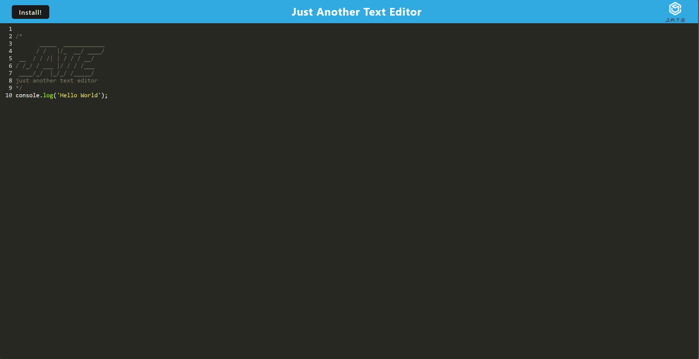
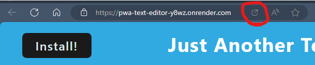

# PWA Text-Editor 

## Preview


## Description
This Progressive Web App is a text editor that allows the user to create code snippets or any text block Whether connectedto the internet or not. Text in the editor will be saved upon reopen.

## Table of Contents
- [Installation](#installation)
- [Usage](#usage)
- [License](#license)
- [Contribution](#contribution)
- [Testing](#testing)
- [Contact](#contact)

## Installation
To install, first clone the repo and ensure all dependencies are installed with the following command:
```
npm run install
```
Next you can start the app using this command: 
```
npm run start
```
You can also install the app from the browser by hitting the install button either on the header of the app, or on the right in the address bar of your browser 



## Usage
You can use it from a cloned repository, or you can use it from the deployed link:
https://pwa-text-editor-y8wz.onrender.com

## Licence [](https://opensource.org/licenses/MIT)
MIT

## Contribution
[](https://www.contributor-covenant.org/)


## Testing


## Contact

Email: KeanuF2017@gmail.com
Github: Github: https://github.com/KeanuFord
